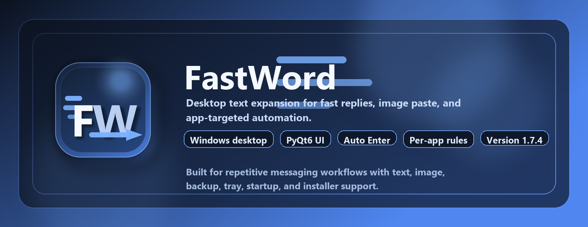
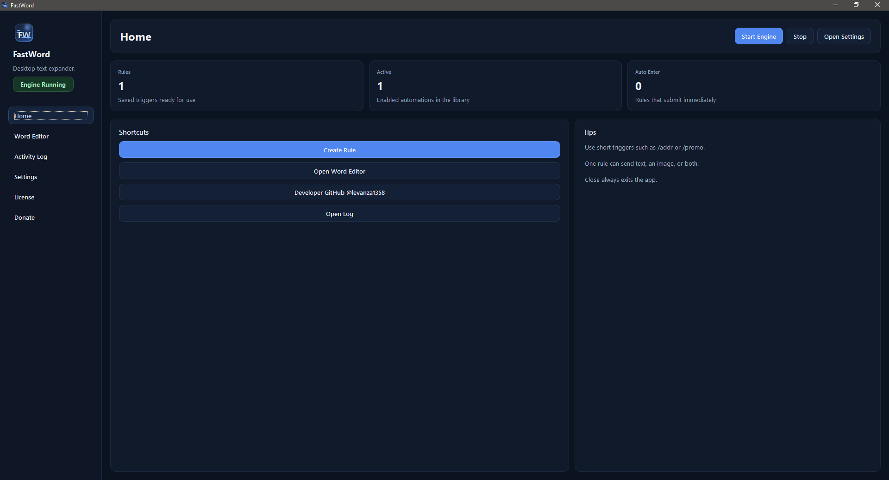
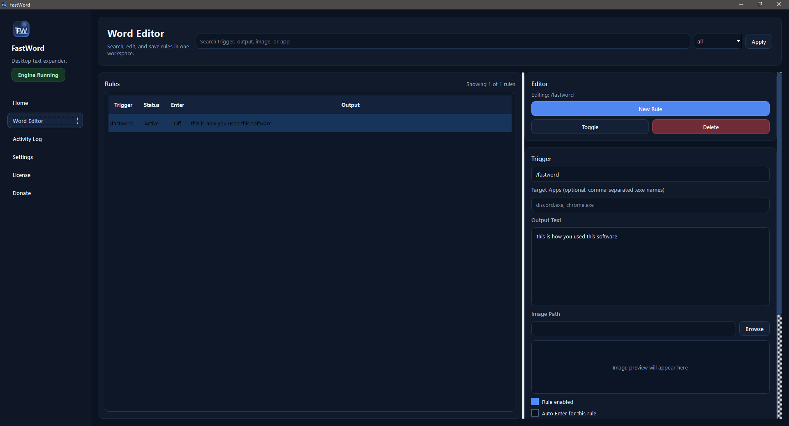
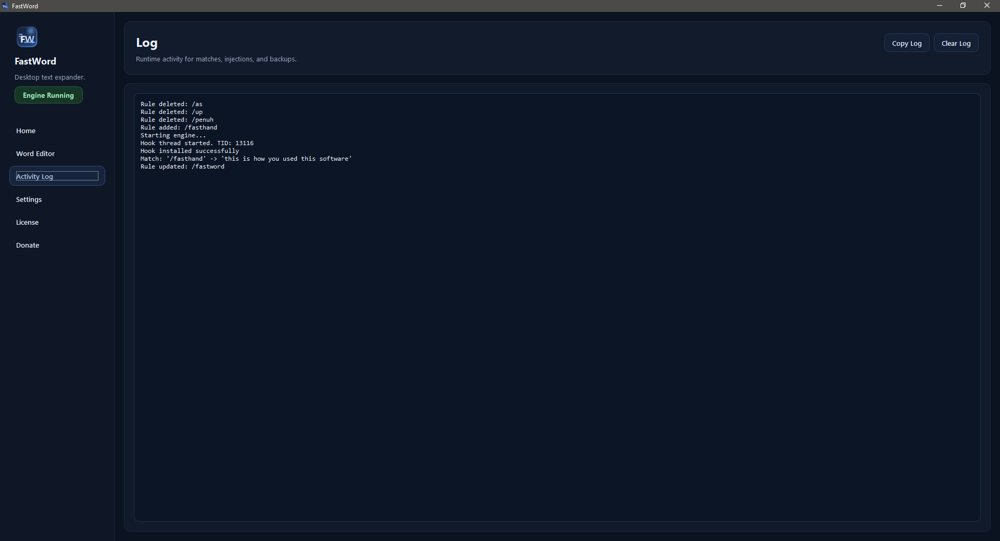
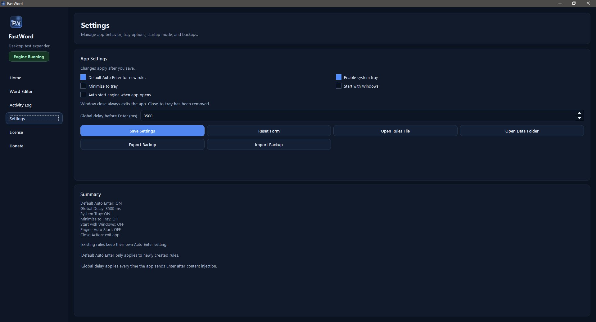

<p align="center">
  
</p>

<p align="center">
  <strong>FastWord</strong> is a Windows desktop text expander for fast replies, image paste, app-targeted rules, Auto Enter, and installer-ready distribution.
</p>

<p align="center">
  Version 1.7.4 | Windows 10/11 | Python 3.12+ | PyQt6
</p>

## Overview

FastWord is built for repetitive desktop messaging workflows.

It lets you type a trigger such as `/promo`, `/addr`, or `/followup` and instantly replace it with:

- text
- an image
- text plus image
- optional Auto Enter submission
- app-specific behavior based on executable name

This makes it useful for support replies, admin work, customer chat handling, marketplace operations, and any workflow that depends on repeated desktop text entry.

## Screenshots

A quick look at the main FastWord desktop pages.

| Home | Word Editor |
| --- | --- |
|  |  |
| Clean dashboard with engine controls and shortcuts. | Rule search, inline editing, previews, and app targeting. |

| Settings | Donate |
| --- | --- |
|  |  |
| Startup, tray, delay, and automation preferences. | Built-in support page with PayPal and developer links. |

## What FastWord Can Do

- Global text expansion on Windows
- Per-rule output text
- Per-rule image paste support
- Per-rule Auto Enter
- Per-rule app targeting such as `discord.exe` or `chrome.exe`
- Live rule search and filtering
- Inline editor with image preview
- Activity log with copy and clear actions
- Settings page for runtime behavior
- Optional system tray support
- Optional minimize-to-tray behavior
- Optional Start with Windows
- Optional engine auto-start when the app opens
- Backup export and import
- Built-in License and Donate pages
- Standalone `.exe` build
- Windows installer build

## Rule Model

Each rule can contain:

- `Trigger`
- `Output Text`
- `Image Path`
- `Enabled`
- `Auto Enter`
- `Target Apps`

Examples:

- Text only
- Image only
- Text + image
- Global rule
- App-specific rule

`Target Apps` should contain executable names only, for example:

- `discord.exe`
- `chrome.exe`
- `whatsapp.exe`
- `discord.exe, chrome.exe`

Behavior:

- If `Target Apps` is empty, the rule is global
- If `Target Apps` is filled, the rule only works in those apps
- Duplicate triggers are blocked when their app scope overlaps

## Desktop Pages

FastWord includes:

- `Home` for quick actions and high-level stats
- `Word Editor` for rule creation, editing, search, filter, and preview
- `Activity Log` for runtime events
- `Settings` for startup, tray, delay, and automation behavior
- `License` for software terms
- `Donate` for support links

## Settings

The current settings include:

- Default Auto Enter for new rules
- Enable system tray
- Minimize to tray
- Start with Windows
- Auto start engine when app opens
- Global delay before Enter

Important behavior:

- Closing the window exits the app
- Only minimizing can send the app to the tray when tray support is enabled

## Quick Start

1. Install Python dependencies.
2. Launch FastWord.
3. Create one or more rules in `Word Editor`.
4. Start the engine.
5. Type a trigger in a supported Windows application.
6. FastWord replaces the trigger with the configured content.

## Requirements

- Windows 10 or Windows 11
- Python 3.12 or newer

## Installation

Install runtime dependencies:

```powershell
python -m pip install -r requirements.txt
```

Install packaging dependencies:

```powershell
python -m pip install -r requirements-dev.txt
```

## Run From Source

```powershell
python main.py
```

## Build The Executable

```powershell
powershell -ExecutionPolicy Bypass -File .\build.ps1
```

Output:

`dist\FastWord.exe`

## Build The Installer

```powershell
powershell -ExecutionPolicy Bypass -File .\build-installer.ps1
```

Output:

`dist\installer\FastWord-Setup.exe`

## Storage

Application data is stored in:

`%APPDATA%\FastWord\rules.json`

Backups created from the app are stored in the same folder.

Legacy data from the previous app name is migrated automatically when available.

## Backup And Restore

FastWord supports:

- Export backup
- Import backup
- Automatic pre-import backup creation

This makes it easier to move rules between devices or recover an earlier setup.

## Notes And Limitations

- FastWord is Windows-only.
- Some target apps handle clipboard and Enter submission differently.
- Image paste support depends on whether the target app accepts pasted image content.
- Auto Enter timing may need adjustment depending on the target app and payload.
- For app targeting, always use executable names, not window titles.

## Donation

The app includes a `Donate` page with:

- PayPal support link
- Developer GitHub link

## License

FastWord is distributed under the proprietary license in [LICENSE](LICENSE).

## Developer

- Developer: `Developer`
- GitHub: `https://github.com/levanza1358`
